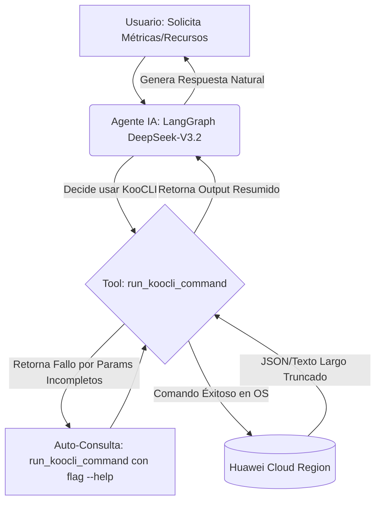

# LangGraph Huawei Cloud Agent (DevSecOps con KooCLI)

Este proyecto implementa un agente conversacional autónomo utilizando **LangGraph** y **LangChain** que actúa como un experto en DevSecOps para Huawei Cloud. En lugar de interactuar directamente con APIs REST complejas o requerir firmas criptográficas manuales, el agente utiliza **KooCLI (hcloud)** por debajo para inspeccionar, gestionar y desplegar recursos en tu cuenta de manera segura y eficiente.

## 🤖 ¿Qué hace este Agente de Chat?
- **Gestión Autonóma (Text-to-Cloud)**: El bot traduce tus intenciones en lenguaje natural (ej. *"Crea una red nueva"*) a comandos estructurados de la línea de comandos de Huawei Cloud (`hcloud`).
- **Capacidad de Auto-Depuración**: Si desconoce los parámetros exactos para crear o modificar un recurso (creaciones POST/PUT), el agente está programado para consultarse a sí mismo leyendo el manual de ayuda interno (`hcloud <servicio> <operacion> --help`) en tiempo real. Entiende los esquemas requeridos y reintenta crear el payload hasta tener éxito.
- **Manejo Multi-Región Transparente**: Reconoce a qué región (ej. `ap-southeast-1` o `la-south-2`) va dirigida tu instrucción e inyecta dinámicamente el `project_id` correspondiente sin que la CLI rechace la solicitud por permisos inválidos de IAM.

## 🏗 Arquitectura y Flujo

El ciclo de pensamiento y ejecución del chatbot es el siguiente:



## ⚙️ Requisitos Previos

Para ejecutar este proyecto de forma limpia tanto en **Linux** como en **Windows**, debes cumplir con lo siguiente:

### 1. Instalar la herramienta KooCLI (`hcloud`)
El agente no hace solicitudes a internet, hace uso local de tu binario de Huawei Cloud.
- Descarga e instala **KooCLI** desde la [documentación oficial de Huawei Cloud](https://support.huaweicloud.com/intl/en-us/usermanual-hcli/hcli_02_001.html).
- Verifica que el comando se ejecute abriendo una terminal nueva y escribiendo `hcloud --version`. 
- *(El agente usará este binario para construir las credenciales al vuelo sin que configures profiles persistentes si así lo prefieres)*.

### 2. Configurar Variables de Entorno (`.env`)
En el repositorio existe un archivo `.env` vacío o de ejemplo. Llénalo con la siguiente estructura y reemplaza con tus valores:

```env
# API de Inteligencia Artificial (Huawei ModelArts / OpenAI Compatible)
MAAS_API_KEY=tu_api_key_de_ModelArts
TAVILY_API_KEY=tu_api_key_de_tavily # Opcional/Desactivado temporalmente

# Credenciales y Configuración de Huawei Cloud
HUAWEI_AK=tu_access_key
HUAWEI_SK=tu_secret_key
HUAWEI_PROJECT_ID=tu_project_id_primario  # ej. 3730059391174eab90c8326ffa136922
HUAWEI_REGION=la-north-2                  # ej. tu región default preferida
```

## 🚀 Cómo correr el proyecto

Se recomienda utilizar **uv** como gestor de paquetes y dependencias en Python, ya que este proyecto cuenta con su respectivo `uv.lock`.

1. **Instalar `uv`**:
   - **Linux / macOS**: `curl -LsSf https://astral.sh/uv/install.sh | sh`
   - **Windows (PowerShell)**: `powershell -ExecutionPolicy ByPass -c "irm https://astral.sh/uv/install.ps1 | iex"`

2. **Instalar las dependencias de Python**:
   Usa `uv` para instalar de manera ultra rápida las librerías necesarias listadas en el proyecto:
   ```bash
   uv pip install -r requirements.txt
   ```
   *(También puedes usar pip tradicional: `pip install -r requirements.txt`)*

3. **Iniciar el Chatbot**:
   Ejecuta el archivo principal en tu terminal usando `uv run`:
   ```bash
   uv run main.py
   ```

3. **¡Comienza a interactuar!**
   Aquí tienes algunos ejemplos de interacciones maravillosas con las que el bot puede lidiar:
   - *"Muéstrame un resumen usando RMS CollectAllResourcesSummary en Singapur (ap-southeast-1)"*
   - *"Lista todas mis instancias ECS actuales."*
   - *"Crea una nueva VPC llamada 'Red-Produccion-01'. Si no funciona a la primera, revisa el --help e injéctalo como dict anidado."*
   - *"Muéstrame información sobre mi facturación del mes 2026-03."*
